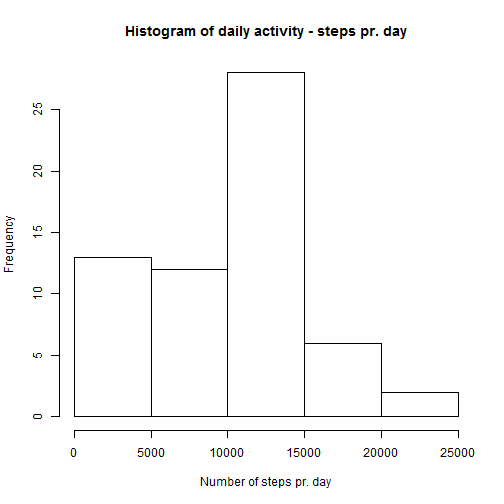
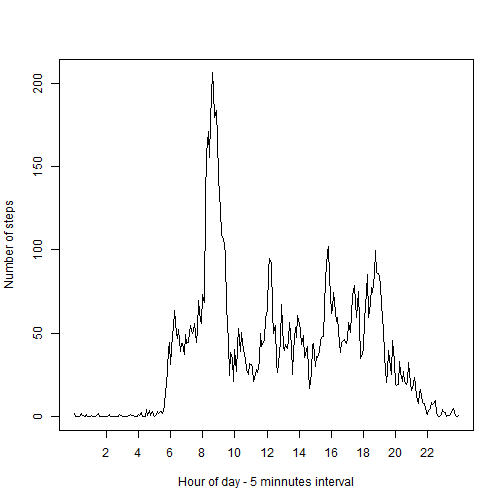
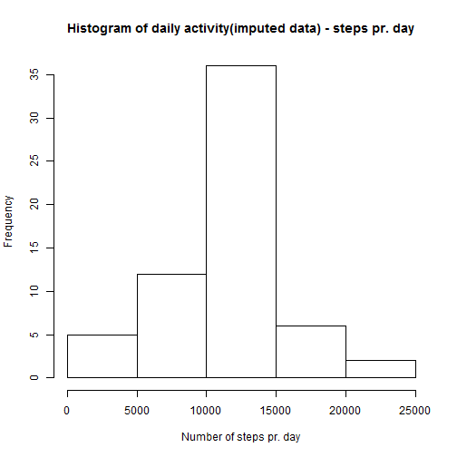

# Reproducible Research: Peer Assessment 1
This document and the code that makes it, is produced as Peer Assessment 1 for the Corusera course **Reproducible Research**.


Load the used libraries.


```r
library(plyr)
library(lubridate)
```


## Loading and preprocessing the data

Data file _activity.csv_ must be in the working directory of R


```r
#Days of the week in English
language <- "English" 
Sys.setlocale("LC_TIME", language) 
activity.df <- read.csv(file="activity.csv",colClasses=c("numeric","character","numeric"))
# Add Date to df - to be able to extract Daytype
activity.df$Date <- strptime(activity.df$date,"%Y-%m-%d")
# Convert HHMI format to get minnutes after midnight, x-axis will then have the right porportions 
activity.df$Minnutes <- (activity.df$interval%/%100)*60 + activity.df$interval%%100
# set if day is Weekend or Weekday
activity.df$Daytype <- ifelse(lubridate::wday(activity.df$Date, label=TRUE) %in% c("Sun","Sat"),"Weekend", 
                          ifelse(lubridate::wday(activity.df$Date, label=TRUE) %in% c("Mon","Tues","Wed","Thurs","Fri"),
                             "Weekday",NA))
```


## What is mean total number of steps taken per day?


```r
# Compute number of steps pr. day.
activity_day.df <- ddply(activity.df, .(date), summarise,
                     sum_steps = sum(steps, na.rm = TRUE))
```


```r
mean_steps_pr_day <- as.character(round(mean(activity_day.df$sum_steps)))
median_steps_pr_day  <- as.character(round(median(activity_day.df$sum_steps)))
```

Based on the dataset, ignoring missings values, the mean is 9354 and the median is 10395.


```r
par(mfrow=c(1,1))
hist(activity_day.df$sum_steps,main="Histogram of daily activity - steps pr. day")
```

 

As the plot abowe shows - the histogram shows a skewed distribution, skewed towards a lower than avarage number on steps.


## What is the average daily activity pattern?

```r
#Make a summary on the interval
activity_minnutes.df <- ddply(activity.df, .(Minnutes), summarize,
                          mean_steps = mean(steps, na.rm = TRUE))

par(mfrow=c(1,1))
plot(activity_minnutes.df$Minnutes/60,activity_minnutes.df$mean_steps,type="l",ylab="Number of steps",xlab="Hour of day - 5 minnutes interval",
     xaxp = c(2,22,10))
```

 

Based oh the graph above it is seen that avarage daily activity patters shows that there is little physical activity measured as steps done during the night.

```r
#The maximum activity interval.
max_activity_interval_value <- max(activity_minnutes.df$mean_steps)
max_activity_interval_Minnutes <- activity_minnutes.df$Minnutes[activity_minnutes.df$mean_steps==max_activity_interval_value]
max_activity_hour <- max_activity_interval_Minnutes%/% 60
max_activity_minnute <- max_activity_interval_Minnutes%% 60
max_activity_interval_value <- round(max_activity_interval_value)
```
Based on the dataset, ignoring missings values, the avarage maximum activity interval is at 8:35 with on avarage 206 steps.


## Imputing missing values

```r
num_of_rows <- nrow(activity.df)
num_of_NA_rows <- nrow(subset(activity.df,is.na(steps)))
```

In the data set with 17568 intervals, 2304 are missing data on how many steps that have been done.
To remedy this the following strategy to impute data will be followed:

Based on the intervals for weekends and weekdays with measurements, the missing data will be imputed with the avarage
value for the missing interval on weekends or weekdays, depending on what type of day it is. 


```r
#The avarage interval value for Weekdays and Weekends 
activity_minnutes_day_type.df <- ddply(activity.df, .(Minnutes,Daytype), summarize,
                                       mean_steps = mean(steps, na.rm = TRUE))

#Function to impute 
steps_impute <- function(pSteps, pDaytype, pMinnutes) {
# It is difficuly to handele NA in sigle value comparisons. -1 is chosen instead of NA
  
  if (pSteps == -1) {
    ret_val <- subset(activity_minnutes_day_type.df,Daytype==pDaytype & Minnutes==pMinnutes)$mean_steps
  }
  else {
    ret_val <- pSteps
  }
  ret_val
}

# Impute the value, the ifelse part converts a NA value to -1
# Maybe an apply would have been smarter - but to me this is more readable
for(i in 1:nrow(activity.df)) {
  activity.df[i,]$steps <- steps_impute(ifelse(is.na(activity.df[i,]$steps),-1,activity.df[i,]$steps),
                                        activity.df[i,]$Daytype,
                                        activity.df[i,]$Minnutes)
}
```

### How do data look now on daily afctivity


```r
new_activity_day.df <- ddply(activity.df, .(date), summarise,
                     sum_steps = sum(steps, na.rm = TRUE))
```


```r
new_mean_steps_pr_day <- as.character(round(mean(new_activity_day.df$sum_steps)))
new_median_steps_pr_day  <- as.character(round(median(new_activity_day.df$sum_steps)))
```
Based on the imputed dataset, the mean is 10762 and the median is 10571.
This is as expected, because imputing data will make the number of steps on a day increase if the day has missing values.


```r
par(mfrow=c(1,1))
hist(new_activity_day.df$sum_steps,main="Histogram of daily activity(imputed data) - steps pr. day")
```

 

A graph on dayly activity is plotted based on the impluded dataset.
It shows that the histogram on steps pr. day becomes more bell shaped. 


### And the daily activity pattern?


```r
new_activity_minnutes.df <- ddply(activity.df, .(Minnutes), summarize,
                          mean_steps = mean(steps, na.rm = TRUE))
```


```r
par(mfrow=c(1,1))
plot(new_activity_minnutes.df$Minnutes/60,new_activity_minnutes.df$mean_steps,type="l",ylab="Number of steps",xlab="Hour of day - 5 minnutes interval",
     xaxp = c(2,22,10))
```

 

Comparing the graph for daily activity on the orginal dataset and the imputed dataset shows that the graphs are very similar in shape.
This is as expeted because the imputed data for an interval is based on the data for the same interval where there is no missing values.

## Are there differences in activity patterns between weekdays and weekends?


```r
#Compute the avarage number of steps pr. interval and daytype
new_activity_minnutes_day_type.df <- ddply(activity.df, .(Minnutes,Daytype), summarize,
                          mean_steps = mean(steps, na.rm = TRUE))
# Create two new datasets to plot.
new_activity_minnutes_weekday.df <- subset(new_activity_minnutes_day_type.df,Daytype=="Weekday")
new_activity_minnutes_weekend.df <- subset(new_activity_minnutes_day_type.df,Daytype=="Weekend")
```


```r
par(mfrow=c(2,1))
par(mar=c(4,4,1,1))
plot(new_activity_minnutes_weekend.df$Minnutes/60,new_activity_minnutes_weekend.df$mean_steps,type="l",
     ylab="Number of steps",
     xlab="Hour of day - 5 minnutes interval",
     main="Weekends",
     xaxp = c(2,22,10))

plot(new_activity_minnutes_weekday.df$Minnutes/60,new_activity_minnutes_weekday.df$mean_steps,type="l",
     ylab="Number of steps",
     xlab="Hour of day - 5 minnutes interval",
     main="Weekdays",
     xaxp = c(2,22,10))
```

 

Based oh the graph above it can be seen that the movement pattern based on steps is different for the meassured person, during weekdays compared to weekends.

